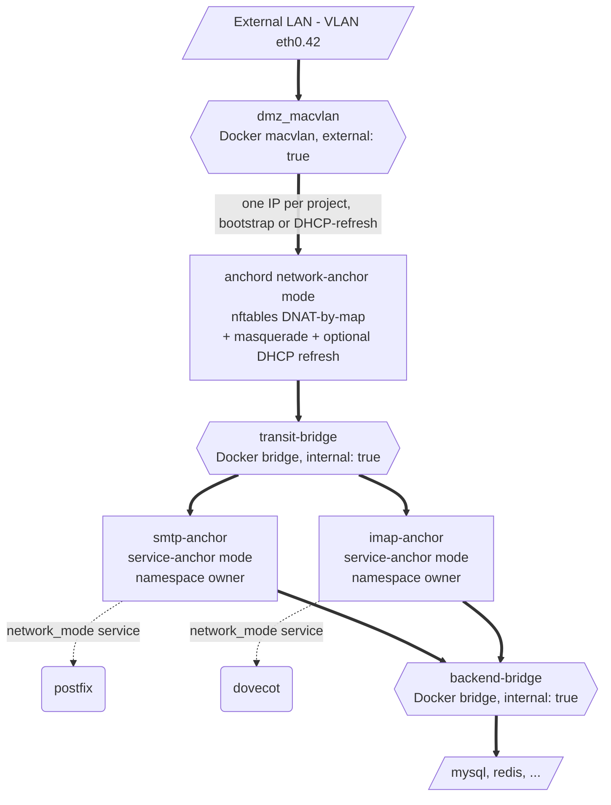

# anchord

[](https://github.com/AlexCherrypi/anchord/actions/workflows/ci.yml)
[](https://github.com/AlexCherrypi/anchord/pkgs/container/anchord)
[](go.mod)
[](LICENSE)
[](https://deepwiki.com/AlexCherrypi/anchord)

> One IP per Compose project. No subnet bookkeeping. Real client source IPs.

> **Status (2026-05-20):** in production on a small self-hosted fleet
> (TrueNAS SCALE host, 6+ Compose stacks, ~14 service-anchors —
> Mailcow, Authentik, Nextcloud-AIO, Traefik, …). v2 has shipped;
> v2.x deltas (F-41 through F-46) cover the wrap-pattern,
> label-selector discovery, runtime-spawned managed service-anchors,
> port-translating DNAT, and authoritative default-route handling
> via DHCP Option 3. See [SPEC-v2-DRAFT.md](SPEC-v2-DRAFT.md) plus
> the per-feature `SPEC-*-DRAFT.md` files for the contracts.

**Built for self-hosted, homelab, and small-fleet workloads** that want
classical "one server, one service" semantics — Mailcow, Nextcloud,
Matrix/Synapse, Gitea, anything that historically ran on its own box.

`anchord` is a per-project network anchor for Docker Compose. It gives a
Compose project a single externally-routable IP — by joining a shared
Docker macvlan network, optionally refreshing the address via DHCP with a
stable hostname — and dynamically maintains nftables DNAT rules pointing
at labelled service-anchor containers, without you ever hard-coding an IP
inside the project. Fully dual-stack: IPv4 and IPv6 are independent and
both surface through the same DNAT/MASQUERADE plane.

It exists because we wanted "one server, one service-pack" semantics back —
the way it used to be when Mailcow lived on its own physical box, Nextcloud
on another, and so on — but with the operational ergonomics of Compose.

## Status

**Production.** Running on a small self-hosted fleet since 2026-05.
Both modes implemented, full observability (metrics + health),
comprehensive test suite (unit + integration + e2e across all DHCP
scenarios incl. stateful DHCPv6). The pre-v1 question — "does this
hold up on a real Linux box with a physical VLAN?" — has been
answered by weeks of uptime under real workloads (SMTP, IMAP IDLE,
LDAP binds, OIDC, video calls via Nextcloud Talk). The
auto-generated report at the bottom is the release-readiness signal.

*(Designed in a bathtub conversation. Has held up better than that
has any right to.)*

### What v2.x adds on top of v2

The deltas since the v2 cut-over (each lives in its own
`SPEC-*-DRAFT.md`; the codepath is gated behind one env var):

- **F-39 / F-40 — Wrap pattern.** Service-anchors that join an
  existing app container's netns via `network_mode: container:<X>`.
  Lets you wrap a third-party Compose project (Mailcow, AIO) without
  touching its compose file.
- **F-41 — Default-route authority.** The network-anchor enforces
  its default route on the macvlan (not on a Docker bridge), with
  priority `DHCP Option 3 > ANCHORD_EXT_GATEWAY_IP > IPAM.Config.Gateway`.
  Eliminates the asymmetric-reply-via-host-LAN failure mode that
  killed long-lived TCP after ~17 min.
- **F-42 — Label-selector discovery.** Backends matched by an
  operator-supplied label set (`anchord.identity=ldap-outpost`)
  instead of just the Compose project. Required for runtime-spawned
  targets (Authentik outposts, K8s-shape operators).
- **F-43 — Sibling auto-start.** Network-anchor watches docker
  events and starts any `Created`-state sibling whose
  `network_mode: container:<X>` resolves to a now-running target.
- **F-44 — Co-attachment shared-network picker.** When anchord is
  on multiple non-EXT networks, pick the one with the most observed
  backends — settles deterministically, never flaps.
- **F-45 — Managed service-anchors.** Network-anchor creates and
  rebinds the service-anchor on demand when its target is spawned
  (or recreated) outside of Compose. Auto-recovers when an
  orchestrator recreates the target mid-flight (stale-netns detect).
- **F-46 — Port-translating DNAT.** `anchord.expose=tcp/636:6636`
  rewrites the destination port at DNAT time. Lets DMZ-side
  reservation (LDAPS on 636) meet app-side reality (Authentik
  outpost listening on non-privileged 6636).

## The mental model

> **One Compose project = one classical server.**

That's the whole idea. Every service-anchor inside a project shares the same
externally-visible IPv4 and IPv6 — exactly as if `postfix`, `dovecot` and
friends were running side-by-side on a bare-metal host called `mailcow`. From
the outside there is no way to tell them apart; they're just ports on one
machine.

Concretely:

- **Inbound traffic** — clients connect to the project's single external IP.
  anchord's DNAT map routes each port to the right service-anchor inside.
  Postfix sees connections on 25/465/587, dovecot sees 143/993, both arriving
  on what they perceive as their own interface, with the original client
  source IP intact.
- **Outbound traffic** — every container in the project egresses with the
  same source IP, via masquerade. This matters for PTR records, SPF, IP
  reputation, audit trails — anything where "who was that?" needs a single
  consistent answer.
- **Internal addresses** — yes, the service-anchors do have separate
  Docker-bridge IPs on the transit network, because Docker has to route
  packets between them somehow. But that's an implementation detail. From
  the user's perspective, it doesn't exist.

### What this implies

**A given port can only point at one service-anchor.** Two containers that
both want to listen on 443 won't work — but that's also exactly what you'd
have on a real server. If you need multiple services on the same port (e.g.
multiple websites on 443), put a reverse proxy in front as a service-anchor
and let *it* handle the layer-7 multiplexing. anchord stops at layer 4.

This is intentional: anchord doesn't try to be a reverse proxy, an ingress
controller, or a service mesh. It gives you a server-shaped abstraction,
and you build the rest with whatever tools fit.

## How it compares

anchord lives in a niche the usual tools don't quite fill — it's not
a reverse proxy, not an ingress controller, not a service mesh. It's
a layer-4 NAT shim that gives a Compose project a server-shaped
network identity. Quick map:

| Approach | One IP per project? | Real source IPs preserved? | DHCP / hostname on the LAN? | Internal DNS service discovery? |
|---|:---:|:---:|:---:|:---:|
| `ports: "1.2.3.4:80:80"` | manual | no (bridge NAT mangles them) | no | yes |
| `network_mode: host` | shared with host | yes | host's only | no per-stack |
| `network_mode: macvlan` per service | no — one per container | yes | per container | broken (each container is its own L2 endpoint) |
| Traefik / Caddy / nginx in host mode | no | yes for HTTP(S) only | no | yes |
| Kubernetes ingress + LoadBalancer | yes (per Service) | depends on mode | not on bare LAN | yes |
| **anchord** | **yes** | **yes** | **yes** | **yes** |

It's specifically built for *"I want this Compose project to look like
a real server on my LAN"* — the problem nothing else solves cleanly.
anchord stops at layer 4 by design; if you need TLS termination,
hostname routing, or HTTP-aware load balancing, run a reverse proxy
*as* a service-anchor and let it own ports 80/443.

## How it looks

The shared macvlan network is created once per host (out-of-band, or via
a tiny network-only compose project):

```sh
docker network create -d macvlan \
    -o parent=eth0.42 \
    --subnet=192.168.150.0/24 --gateway=192.168.150.1 \
    dmz_macvlan
```

Each consumer project then references it as `external: true`:

```yaml
networks:
  dmz:
    external: true
    name: dmz_macvlan
  transit: { driver: bridge, internal: true }
  backend: { driver: bridge, internal: true }

services:
  anchord:
    image: ghcr.io/alexcherrypi/anchord:latest
    cap_add: [NET_ADMIN]
    mac_address: "02:4c:4b:50:0a:01"   # stable across recreates
    # anchord routes between dmz (macvlan) and transit (bridge), so
    # the kernel needs forwarding on. accept_ra=2 keeps SLAAC working
    # even when forwarding is enabled.
    sysctls:
      net.ipv4.ip_forward: "1"
      net.ipv6.conf.all.forwarding: "1"
      net.ipv6.conf.all.accept_ra: "2"
    networks:
      dmz: { ipv4_address: 192.168.150.100 }   # bootstrap IP
      transit: {}
    environment:
      ANCHORD_PROJECT: ${COMPOSE_PROJECT_NAME}
      ANCHORD_EXT_NETWORK: dmz_macvlan      # resolve iface via Docker API (MAC match)
      ANCHORD_ADDRESS_MODE: dhcp-refresh    # or bootstrap, slaac-ra-only
      ANCHORD_DHCP_HOSTNAME: mailcow
      DOCKER_HOST: tcp://docker-proxy:2375

  smtp-anchor:
    image: ghcr.io/alexcherrypi/anchord:latest
    cap_add: [NET_ADMIN]
    environment:
      ANCHORD_MODE: service-anchor
    networks: [transit, backend]
    labels:
      anchord.expose: "tcp/25,tcp/465,tcp/587"

  postfix:
    image: postfix:latest
    network_mode: "service:smtp-anchor"
```

The full example with backend services lives in
[compose.example.yaml](compose.example.yaml). Wrapping an existing
Compose project (Mailcow, Nextcloud-AIO, …) without touching its
compose file: see [compose.example-wrap.yaml](compose.example-wrap.yaml)
and the two-patterns section in [ARCHITECTURE.md](ARCHITECTURE.md).

That's it. anchord doesn't plumb the macvlan itself — Docker handles
that and hands anchord a regular interface. anchord watches the docker
socket, finds containers in the same compose project that carry the
`anchord.expose` label, and wires up nftables DNAT entries pointing at
their current bridge-network IPs. When containers restart and get new
IPs, the maps update atomically and stale conntrack entries are flushed.

### One image, two modes

The `anchord` image plays two roles in a project:

- **Network-anchor** (`ANCHORD_MODE=network-anchor`, the default). One per
  project. Joins the shared Docker macvlan network, optionally refreshes
  its IP via DHCP (`ANCHORD_ADDRESS_MODE=dhcp-refresh`), and maintains
  the nftables NAT state.
- **Service-anchor** (`ANCHORD_MODE=service-anchor`). One per exposed service.
  Resolves the network-anchor via Docker DNS, installs and maintains a default
  route via it, and serves as the namespace owner that real application
  containers join via `network_mode: service:<anchor>`.

Both roles run the same binary; the mode is just an env var. As an alternative
spelling, `command: [service-anchor]` does the same as setting `ANCHORD_MODE`.

## Architecture

For the full picture — the three-role model (network-anchor,
service-anchors, backends), how traffic flows end-to-end, and the
invariants the code relies on — read [ARCHITECTURE.md](ARCHITECTURE.md).
The sketch below is the one-screen version.

Two companion docs round out the picture:
[SPEC.md](SPEC.md) is the contract anchord must meet (functional
requirements, acceptance scenarios, non-goals), and
[CONTEXT.md](CONTEXT.md) records the design rationale and the
alternatives that were considered and rejected.



Three layers, by design:

1. **External** — a Docker macvlan network (`external: true`) shared by
   every project that wants a LAN-visible IP. Docker plumbs the
   host-side VLAN sub-interface and assigns each anchord container its
   MAC and bootstrap IPv4 (declare `mac_address:` in compose for
   stability; the DHCP client-id is derived from
   `ANCHORD_DHCP_HOSTNAME` and is independent of the MAC, so
   reservations stick across recreates).
2. **Transit** — internal Docker bridge connecting anchord to the
   service-anchors. `internal: true` ensures no Docker-managed MASQUERADE
   meddles with our paths.
3. **Backend** — internal Docker bridge for service-to-DB traffic. Most
   containers live here, never see the transit network.

### Why DNAT-by-map?

nftables named maps let us express the entire DNAT table as a single rule
that consults a key/value lookup (the iface name is whatever Docker gave
us — `eth0` by default, override via `ANCHORD_EXT_IFACE`):

```
iifname "eth0" meta l4proto tcp dnat to tcp dport map @dnat_tcp
```

When a container restarts and its IP changes, we replace the map's contents
in one atomic transaction. No rule deletions, no microsecond windows where
packets fall through.

### Why masquerade outbound, not SNAT?

Masquerade automatically tracks the current source IP of the egress
interface — so when DHCP renews into a new lease, outbound traffic just
keeps working. SNAT to a literal IP would need re-pushing on every lease
change.

### Why no `ports:` mapping anywhere?

Because `ports:` invokes Docker's userland proxy and bridge-NAT, which both
mangle source IPs. anchord's whole point is to *not* go through that. Inbound
traffic enters the macvlan interface, hits anchord's DNAT in the kernel, and
arrives at the service-anchor with the original client IP intact.

## Configuration

All via environment variables.

### Common (both modes)

| Variable                     | Required | Default            | Notes |
|------------------------------|----------|--------------------|-------|
| `ANCHORD_MODE`               | no       | `network-anchor`   | `network-anchor` or `service-anchor`. `command: [service-anchor]` is an equivalent override. |
| `ANCHORD_LOG_LEVEL`          | no       | `info`             | `debug`/`info`/`warn`/`error` |
| `ANCHORD_METRICS_ADDR`       | no       | `127.0.0.1:9090`   | Prometheus `/metrics` listen address. Loopback-only by default to avoid LAN exposure on the macvlan; set `:9090` to scrape from other compose services. `""` disables. |

### Network-anchor mode

| Variable                     | Required | Default            | Notes |
|------------------------------|----------|--------------------|-------|
| `ANCHORD_PROJECT`            | yes¹     | `$COMPOSE_PROJECT_NAME` | Scope of containers anchord manages. Required unless `ANCHORD_LABEL_SELECTOR` is set. Ignored (with a WARN log) when both are set |
| `ANCHORD_LABEL_SELECTOR`     | no       |                    | F-42: replaces the project filter with an operator-defined label set, comma-separated `key=value` AND-joined (e.g. `anchord.role=ldap-outpost,env=prod`). Use when multiple anchords share a project, or when target containers are spawned outside Compose and carry no project label (e.g. authentik outposts) |
| `ANCHORD_AUTOSTART_SIBLINGS` | no       | `true`             | F-43: watch Docker for `container start` events and bootstrap any sibling container in `Created` state whose `network_mode: container:<X>` matches the just-started target. Needed for service-anchors whose target is spawned at runtime (e.g. authentik outposts via the Docker API). Requires `POST=1` on the docker-socket-proxy. Set to `false` to disable |
| `ANCHORD_AUTOFIX_DEAD_NETNS` | no       | `true`             | Issue #10: when the network-anchor recreates its F-45-managed service-anchor (stale-netns or image-drift path), also re-create every wrap dependent that was pinned to the old SA's container ID. Without this, the dependents end up in a destroyed netns and look running to Docker while being invisible to the outside. Requires `DELETE=1` + container create/start on the docker-socket-proxy (same set F-45's existing SA recreate already needs). Set to `false` to keep v1.1.0 behaviour (detection-only via the dependents watcher's WARN log) |
| `ANCHORD_MANAGED_SA_TARGET`  | no       |                    | F-45: stable name of a runtime-spawned target container. When set, the network-anchor not only auto-starts existing Created-state siblings (F-43) but CREATES a service-anchor on demand when this target appears. Needed when Compose cannot declare the service-anchor (target doesn't yet exist at compose-up time and Compose halts on create-then-cant-start). Empty = pure F-43 behaviour |
| `ANCHORD_MANAGED_SA_NAME`    | no       | `<TARGET>-service-anchor` | F-45: name of the container the network-anchor creates. Only consulted when `ANCHORD_MANAGED_SA_TARGET` is set |
| `ANCHORD_MANAGED_SA_IMAGE`   | no       | (anchord's own image) | F-45: image for the managed service-anchor. Default resolved at runtime from the network-anchor's own container inspect — keeps both containers on the same image version |
| `ANCHORD_MANAGED_SA_GATEWAY_IP` | no    | (anchord's IP on shared network) | F-45: value passed as `ANCHORD_GATEWAY_IP` to the managed service-anchor. Default resolved at runtime from anchord's IP on whichever network the F-44 picker chose |
| `ANCHORD_MANAGED_SA_EXTRA_ENV` | no    | `{}`               | F-45: additional env vars for the managed service-anchor, as a JSON object `{"KEY":"value",…}`. Operator overrides win against the standard `ANCHORD_*` defaults |
| `ANCHORD_MANAGED_SA_LABELS`  | no       | `{}`               | F-45: labels to stamp on the managed service-anchor, as JSON `{"key":"value",…}`. Use case: inject `anchord.identity` / `anchord.expose` so an F-42 label-selector network-anchor can discover its own spawn. Reserved keys are rejected at load: `com.docker.compose.*` and `anchord.managed-by` |
| `ANCHORD_ADDRESS_MODE`       | no       | `bootstrap`        | `bootstrap` (keep Docker-assigned IP), `dhcp-refresh` (DHCP-replace it), or `slaac-ra-only` (Docker-assigned v4, kernel SLAAC for v6) |
| `ANCHORD_EXT_NETWORK`        | no       |                    | Docker network name of the external macvlan (e.g. `dmz_macvlan`). When set, anchord resolves its iface via the Docker API by MAC match. **Strongly recommended for any stack with 2+ networks** — `ANCHORD_EXT_IFACE=eth0` is a coin flip across recreates because Docker's eth0/eth1 assignment is non-deterministic |
| `ANCHORD_EXT_GATEWAY_IP`     | no       | (auto-resolved)    | F-41: gateway IP for the default route enforced on the external iface. Comma-separated v4,v6 (same shape as service-anchor `ANCHORD_GATEWAY_IP`). Empty = read `IPAM.Config.Gateway` from `ANCHORD_EXT_NETWORK` via Docker NetworkInspect. In `dhcp-refresh` mode, DHCP Option 3 from the lease overrides both — wins forever once the first lease arrives. Pin when the macvlan is external without Docker-visible IPAM, or when you intentionally want a different gateway than DHCP/Docker would pick |
| `ANCHORD_SHARED_NETWORK`     | no       |                    | F-44: pins the Docker network anchord uses to read backend IPs. When set, must be one of the networks anchord is attached to. Unset = heuristic mode (pick the candidate with the most backend co-attachment, ties via "transit" preference then alphabetical, re-evaluated until a backend is observed). Use when you have multiple transit-named bridges and the heuristic picks the wrong one |
| `ANCHORD_EXT_IFACE`          | no       | `eth0`             | In-container name of the macvlan interface. Used only when `ANCHORD_EXT_NETWORK` is unset; if both are set, `ANCHORD_EXT_NETWORK` wins and a WARN is logged |
| `ANCHORD_DHCP_HOSTNAME`      | no       | = project name     | Announced to the DHCP server in `dhcp-refresh`; also the basis of the DHCP client-id, so reservations are sticky across MAC changes |
| `ANCHORD_POLL_INTERVAL`      | no       | `30s`              | Safety-net reconcile cadence |
| `ANCHORD_DHCP_BACKOFF_MAX`   | no       | `5m`               | Max backoff between DHCP-client retries on protocol errors (only meaningful in `dhcp-refresh`) |
| `DOCKER_HOST`                | no       | unix socket        | Set to `tcp://docker-proxy:2375` for socket-proxy mode |

The MAC is declared by the operator in compose (`mac_address:`),
not by anchord. If you don't pin one, Docker picks a deterministic
MAC from the container name; either way the DHCP client-id is what
keeps reservations stable across recreates.

### Service-anchor mode

| Variable                            | Required | Default   | Notes |
|-------------------------------------|----------|-----------|-------|
| `ANCHORD_GATEWAY_HOSTNAME`          | no       | `anchord` | Compose-network DNS name to look up for the network-anchor's transit IP. Ignored when `ANCHORD_GATEWAY_IP` is set |
| `ANCHORD_GATEWAY_IP`                | no       |           | Explicit gateway address(es), comma-separated v4 and/or v6 (e.g. `192.168.0.1,fd00::1`). When set, skips DNS resolution and routes directly to these addresses. Required for the wrap pattern (F-40) where the service-anchor runs inside a target container belonging to a different Compose project |
| `ANCHORD_GATEWAY_RESOLVE_INTERVAL`  | no       | `5s`      | How often the service-anchor re-resolves and reconciles its default route (DNS mode only — has no effect when `ANCHORD_GATEWAY_IP` is set) |

## Container labels

On any container that should be exposed via the project's external IP:

| Label                | Example                       | Notes |
|----------------------|-------------------------------|-------|
| `anchord.expose`     | `"tcp/25,tcp/465,udp/4500"` or `"tcp/636:6636,udp/53:5353"` | Comma-separated entries. Each entry is `proto/port` (DNAT keeps the port) or `proto/dmz-port:backend-port` (F-46 port translation — DMZ-side reservation differs from app's listener). Backend-port omitted = same as DMZ-port |
| `anchord.expose.v6`  | `auto` (default) / `off`      | Whether to mirror v4 rules onto AAAA |
| `anchord.identity`   | `ldap-outpost`                | Free-form value matched by `ANCHORD_LABEL_SELECTOR` (F-42). Use when one Compose project hosts multiple anchord stacks, or when targets are spawned outside Compose and don't carry a project label |

## Building

```sh
git clone https://github.com/AlexCherrypi/anchord
cd anchord
go mod tidy
go build ./cmd/anchord
docker build -t anchord:dev .
```

## Testing

The full test suite (Go unit tests + e2e harness across all four DHCP
scenarios) is invoked via `scripts/update-test-report.sh`, which runs
host-independently inside a Docker container and rewrites the
auto-generated **Test report** block at the bottom of this README on
green. See [TESTING.md](TESTING.md) for the per-platform commands and
the release-gate contract.

## Observability

Both modes serve `/metrics`, `/healthz` and `/readyz` on the same
listener (default `127.0.0.1:9090`, loopback-only so the LAN-facing
macvlan never sees it; set `ANCHORD_METRICS_ADDR=:9090` for
project-wide scraping or `""` to disable). The surface is small and
deliberately bounded — see [SPEC §2.7](SPEC.md) for the full table —
the highlights operators usually want to alert on:

- `anchord_dhcp_lease_remaining_seconds{family}` — alert when this
  drops below your renewal window. Recomputed at scrape time.
- `anchord_reconcile_total{result}` — error rate of the main loop.
- `anchord_reconcile_duration_seconds` — verifies SPEC N-3 (≤ 500 ms p99).
- `anchord_dnat_entries{family,proto}` — sanity gauge; spikes or drops
  are a strong signal something is off.
- `anchord_gateway_route_replaces_total{family}` (service-anchor) —
  how often the network-anchor's transit IP changed under us.

Label cardinality is bounded by design (no per-container, per-IP, or
per-port labels) — that would leak the project's internal structure
across the metrics surface, which contradicts the "one project = one
server" model.

### Health endpoints

Same listener, plain text:

| Path | Code | When |
|---|---|---|
| `/healthz` | always `200 ok` | Process is up and serving HTTP. Pure liveness signal — does **not** flip on data-plane issues. |
| `/readyz` (network-anchor) | `200 ready` | Once nftables tables are installed AND the first reconcile has completed. DHCP lease state is not part of readiness — the DNAT path works without one. |
| `/readyz` (service-anchor) | `200 ready` | Once at least one default route (v4 or v6) has been installed. Pair with a Docker `HEALTHCHECK` so app containers joining via `network_mode: service:<anchor>` wait for egress. |

Both `/readyz` variants return `503` with the unmet conditions in the
body while not ready.

## Operator tooling

### `anchord doctor stale-netns`

One-shot diagnostic for the wrap-pattern failure mode tracked in
[issue #9](https://github.com/AlexCherrypi/anchord/issues/9): when a
service-anchor is recreated, every container declaring
`network_mode: service:<that-anchor>` stays pinned to the old
container ID and runs in a netns Docker has destroyed. The
dependents look `running` to Docker but have no interface, no routes,
no DNAT.

```
$ anchord doctor stale-netns
Found 11 dependent(s) in dead netns across 9 target(s):

  dead target: 158f0cc2  (1 victim(s))
    ix-authentik-traefik-frigate-1
      → docker compose -p ix-authentik up -d --no-deps --force-recreate traefik-frigate

  dead target: a7c53426  (3 victim(s))
    acme-init-xibo
    acme-renewer-xibo
    ix-xibo-traefik-1
      → docker compose -p ix-xibo up -d --no-deps --force-recreate traefik
  ...
```

Scans the whole host, no compose project scope, no ANCHORD_*
configuration needed — just docker.sock. Output is grouped by dead
target so victims of the same gone service-anchor cluster, with the
exact compose command to recover each.

When anchord runs in network-anchor mode it also performs the same
detection in the background (scoped to its own compose project) and
emits a structured `WARN dependent in dead netns ...` for every new
victim. The doctor command is for ad-hoc cluster-wide scans (anchord
not running, a different host, post-mortem analysis).

## Caveats and known limitations

- **Kernel ≥ 4.18** required for atomic nftables map replaces.
- **CAP_NET_ADMIN** is required on every anchord container — the
  network-anchor for macvlan + nftables, every service-anchor for
  managing its own default route via netlink.
- **The service-anchor's DNS name must match `ANCHORD_GATEWAY_HOSTNAME`.**
  Default is `anchord`, which matches the canonical service name in the
  example compose. If you rename the network-anchor service, set
  `ANCHORD_GATEWAY_HOSTNAME` on each service-anchor to match.
- **Recreating a service-anchor orphans its wrap dependents** —
  but in the common case anchord now repairs them itself. Any
  container declaring `network_mode: service:fe-anchor-X` is pinned
  to fe-anchor-X's container ID at create-time and stays pinned
  across recreate. When **anchord** recreates its F-45-managed
  service-anchor (stale-netns or image-drift path), it enumerates
  every wrap dependent of the old SA and re-creates each against
  the new SA's ID before returning — see the `ANCHORD_AUTOFIX_DEAD_NETNS`
  flag (default on). When **the operator** recreates a service-anchor
  manually (`docker rm`, `compose up --force-recreate`), anchord's
  v1.1.0 dependents watcher still emits a `WARN dependent in dead netns
  ...` log line per victim with the exact recovery command — auto-fix
  only fires for SA recreates anchord caused itself, because there
  the scope is unambiguous (no race with operator, no scope
  discovery). Use `anchord doctor stale-netns` for a cluster-wide
  one-shot scan after a manual incident.
- **One network-anchor per backend identity.** Default discovery
  scope is the Compose project; two anchords filtering the same set
  of backends will fight over their DNAT entries. With
  `ANCHORD_LABEL_SELECTOR` (F-42), multiple anchord stacks coexist
  cleanly in one Compose project as long as their selectors are
  disjoint (each backend container is matched by exactly one
  network-anchor). Each anchord container has its own netns, so
  the per-process `anchord_v4` / `anchord_v6` nft tables don't
  collide at the kernel level — but the macvlan IPs and DHCP
  reservations still need to be operator-distinct.

## License

MIT — see [LICENSE](LICENSE).

<!-- TEST-REPORT-START -->
## Test report (auto-generated)

This block is rewritten by `scripts/update-test-report.sh` after a
green run of the full test suite — every test below was observed to
produce the listed status on the source tree whose hash is recorded
here. The release pipeline rejects any tag whose recorded hash does
not match the current source, so this block is the project's
release-readiness signal.

- **Last verified:** 2026-05-25T23:30:02Z
- **Code hash:** `sha256:c03a3fb312310688ba3dfacf2d2eadac8fdcac65e171586487752739a8c54ea1`
- **Flood-fix flag:** `E2E_BRIDGE_FLOOD_FIX=1`

### Summary

| Suite | Pass | Fail | Skip | Total |
|---|---:|---:|---:|---:|
| `go vet ./...` | clean | — | — | — |
| Go unit tests | 318 | 0 | 0 | 318 |
| E2E (test/e2e, 5 scenarios) | 74 | 0 | — | 74 |
| **All tests** | **392** | **0** | **0** | **392** |

<details>
<summary>Go unit tests &mdash; 318/318 passed</summary>

| Package | Test | Status |
|---|---|:---:|
| `cmd/anchord` | `TestBuildDiscoveryDiscriminator/empty_selector_empty_project_→_nil_(config_layer_guards_this)` | ✓ |
| `cmd/anchord` | `TestBuildDiscoveryDiscriminator/legacy_project_only` | ✓ |
| `cmd/anchord` | `TestBuildDiscoveryDiscriminator/selector_AND-joined,_deterministic_order_by_key` | ✓ |
| `cmd/anchord` | `TestBuildDiscoveryDiscriminator/selector_alone` | ✓ |
| `cmd/anchord` | `TestBuildDiscoveryDiscriminator/selector_replaces_project_(both_set,_both_ignored_on_selector_path)` | ✓ |
| `cmd/anchord` | `TestBuildDiscoveryDiscriminator_Deterministic` | ✓ |
| `cmd/anchord` | `TestPrintStaleReport` | ✓ |
| `cmd/anchord` | `TestRunDoctor_Dispatch/--help_is_not_an_error` | ✓ |
| `cmd/anchord` | `TestRunDoctor_Dispatch/no_args_prints_usage` | ✓ |
| `cmd/anchord` | `TestRunDoctor_Dispatch/unknown_subcommand_errors` | ✓ |
| `cmd/anchord` | `TestSelectMode/ANCHORD_MODE=service-anchor` | ✓ |
| `cmd/anchord` | `TestSelectMode/doctor_subcommand_recognised` | ✓ |
| `cmd/anchord` | `TestSelectMode/explicit_network-anchor_subcommand` | ✓ |
| `cmd/anchord` | `TestSelectMode/flag-only_args_are_ignored` | ✓ |
| `cmd/anchord` | `TestSelectMode/no_args,_no_env_->_default_network-anchor` | ✓ |
| `cmd/anchord` | `TestSelectMode/subcommand_wins_over_env` | ✓ |
| `cmd/anchord` | `TestSelectMode/unknown_env_errors` | ✓ |
| `cmd/anchord` | `TestSelectMode/unknown_subcommand_errors` | ✓ |
| `internal/autostart` | `TestBackfill_F45_NoImageCheckWhenRecipePinsImage` | ✓ |
| `internal/autostart` | `TestBackfill_F45_NoRebindOnAbsentSA` | ✓ |
| `internal/autostart` | `TestBackfill_F45_NoRebindWhenAutoFixDisabled` | ✓ |
| `internal/autostart` | `TestBackfill_F45_NoRecreateWhenImagesMatch` | ✓ |
| `internal/autostart` | `TestBackfill_F45_ReboundDependentsOnImageDrift` | ✓ |
| `internal/autostart` | `TestBackfill_F45_RecreatesSAOnImageDrift` | ✓ |
| `internal/autostart` | `TestBackfill_NoStrandedSiblings_NoOp` | ✓ |
| `internal/autostart` | `TestBackfill_StartsStrandedCreatedSibling` | ✓ |
| `internal/autostart` | `TestFindOrphanCandidates_ByAllRefForms` | ✓ |
| `internal/autostart` | `TestMatchSiblings_EmptyTargetReturnsNil` | ✓ |
| `internal/autostart` | `TestMatchSiblings_IgnoresNonCreated` | ✓ |
| `internal/autostart` | `TestMatchSiblings_IgnoresUnrelatedNetworkModes` | ✓ |
| `internal/autostart` | `TestMatchSiblings_LeadingSlashTolerated` | ✓ |
| `internal/autostart` | `TestMatchSiblings_LongIDMatch` | ✓ |
| `internal/autostart` | `TestMatchSiblings_MultipleSiblingsAllFire` | ✓ |
| `internal/autostart` | `TestMatchSiblings_NameMatch` | ✓ |
| `internal/autostart` | `TestMatchSiblings_ShortIDMatch` | ✓ |
| `internal/autostart` | `TestNew_NotNil` | ✓ |
| `internal/autostart` | `TestReferencesFor_IncludesShortAndLongID` | ✓ |
| `internal/autostart` | `TestRun_EventTriggersSiblingStart` | ✓ |
| `internal/autostart` | `TestRun_F45_CreateErrorTolerated` | ✓ |
| `internal/autostart` | `TestRun_F45_CreatesAndStartsWhenSAAbsent` | ✓ |
| `internal/autostart` | `TestRun_F45_ExplicitGatewayIPWinsOverSelfIP` | ✓ |
| `internal/autostart` | `TestRun_F45_ExtraEnvAndDeterministicOrder` | ✓ |
| `internal/autostart` | `TestRun_F45_IgnoresDestroyOfUnrelatedContainer` | ✓ |
| `internal/autostart` | `TestRun_F45_IgnoresUnrelatedTargets` | ✓ |
| `internal/autostart` | `TestRun_F45_ImageDriftCheckSkippedOnEvent` | ✓ |
| `internal/autostart` | `TestRun_F45_InactiveRecipeFallsBackToF43` | ✓ |
| `internal/autostart` | `TestRun_F45_NoOpWhenManagedSAAlreadyRunning` | ✓ |
| `internal/autostart` | `TestRun_F45_NoRecreateWhenSANetnsCurrent` | ✓ |
| `internal/autostart` | `TestRun_F45_NoRespawnIfTargetAlsoGone` | ✓ |
| `internal/autostart` | `TestRun_F45_NoSharedNetYetSkipsCreate` | ✓ |
| `internal/autostart` | `TestRun_F45_OperatorLabelsReachSpec` | ✓ |
| `internal/autostart` | `TestRun_F45_RebindContinuesAfterPerDepFailure` | ✓ |
| `internal/autostart` | `TestRun_F45_ReboundDependentsOnStaleNetns` | ✓ |
| `internal/autostart` | `TestRun_F45_RecreatesSAOnDestroy` | ✓ |
| `internal/autostart` | `TestRun_F45_RecreatesSAOnStaleNetns` | ✓ |
| `internal/autostart` | `TestRun_F45_SharedNetworkLookupIsLazy` | ✓ |
| `internal/autostart` | `TestRun_F45_SkipsCreateWhenSAInCreatedState` | ✓ |
| `internal/autostart` | `TestRun_IgnoresNonStartEvents` | ✓ |
| `internal/autostart` | `TestRun_StartFailureIsLoggedButLoopContinues` | ✓ |
| `internal/autostart` | `TestSATargetsStaleNetns/empty_netmode_tolerated` | ✓ |
| `internal/autostart` | `TestSATargetsStaleNetns/non-container_netmode_is_not_our_concern` | ✓ |
| `internal/autostart` | `TestSATargetsStaleNetns/ref_doesn't_resolve_at_all_(dead_netns)` | ✓ |
| `internal/autostart` | `TestSATargetsStaleNetns/ref_is_a_12-char_short-ID_prefix_of_the_current_target` | ✓ |
| `internal/autostart` | `TestSATargetsStaleNetns/ref_resolves_to_a_different_(still-listed)_container` | ✓ |
| `internal/autostart` | `TestSATargetsStaleNetns/ref_resolves_to_current_target_by_full_ID` | ✓ |
| `internal/autostart` | `TestSATargetsStaleNetns/ref_resolves_to_current_target_by_name` | ✓ |
| `internal/autostart` | `TestTargetMatchesRecipe/#00` | ✓ |
| `internal/autostart` | `TestTargetMatchesRecipe//ak-outpost-ldap` | ✓ |
| `internal/autostart` | `TestTargetMatchesRecipe/abcdef012345` | ✓ |
| `internal/autostart` | `TestTargetMatchesRecipe/abcdef0123456789abcdef0123456789abcdef0123456789abcdef0123456789` | ✓ |
| `internal/autostart` | `TestTargetMatchesRecipe/ak-outpost-ldap` | ✓ |
| `internal/autostart` | `TestTargetMatchesRecipe/some-other-container` | ✓ |
| `internal/config` | `TestFingerprintDeterministic` | ✓ |
| `internal/config` | `TestFirstSelectorValue_Deterministic` | ✓ |
| `internal/config` | `TestGetenvDefault` | ✓ |
| `internal/config` | `TestLoadServiceAnchor_Defaults` | ✓ |
| `internal/config` | `TestLoadServiceAnchor_GatewayIPDualStack/192.168.150.1,fd00::1` | ✓ |
| `internal/config` | `TestLoadServiceAnchor_GatewayIPDualStack/fd00::1,_192.168.150.1` | ✓ |
| `internal/config` | `TestLoadServiceAnchor_GatewayIPDuplicateFamily` | ✓ |
| `internal/config` | `TestLoadServiceAnchor_GatewayIPEmpty` | ✓ |
| `internal/config` | `TestLoadServiceAnchor_GatewayIPInvalid` | ✓ |
| `internal/config` | `TestLoadServiceAnchor_GatewayIPSingle/v4` | ✓ |
| `internal/config` | `TestLoadServiceAnchor_GatewayIPSingle/v4_with_whitespace` | ✓ |
| `internal/config` | `TestLoadServiceAnchor_GatewayIPSingle/v6` | ✓ |
| `internal/config` | `TestLoadServiceAnchor_Overrides` | ✓ |
| `internal/config` | `TestLoadServiceAnchor_RejectsZeroInterval` | ✓ |
| `internal/config` | `TestLoad_AddressModeInvalid` | ✓ |
| `internal/config` | `TestLoad_AddressModeOverride/bootstrap` | ✓ |
| `internal/config` | `TestLoad_AddressModeOverride/dhcp-refresh` | ✓ |
| `internal/config` | `TestLoad_AddressModeOverride/slaac-ra-only` | ✓ |
| `internal/config` | `TestLoad_AutoFixDeadNetns/FALSE` | ✓ |
| `internal/config` | `TestLoad_AutoFixDeadNetns/TRUE` | ✓ |
| `internal/config` | `TestLoad_AutoFixDeadNetns/explicit_false` | ✓ |
| `internal/config` | `TestLoad_AutoFixDeadNetns/explicit_true` | ✓ |
| `internal/config` | `TestLoad_AutoFixDeadNetns/garbage_rejected` | ✓ |
| `internal/config` | `TestLoad_AutoFixDeadNetns/shorthand_0` | ✓ |
| `internal/config` | `TestLoad_AutoFixDeadNetns/shorthand_1` | ✓ |
| `internal/config` | `TestLoad_AutoFixDeadNetns/unset_→_default_true` | ✓ |
| `internal/config` | `TestLoad_AutostartSiblings/FALSE` | ✓ |
| `internal/config` | `TestLoad_AutostartSiblings/TRUE` | ✓ |
| `internal/config` | `TestLoad_AutostartSiblings/empty-string_treated_as_default` | ✓ |
| `internal/config` | `TestLoad_AutostartSiblings/explicit_false` | ✓ |
| `internal/config` | `TestLoad_AutostartSiblings/explicit_true` | ✓ |
| `internal/config` | `TestLoad_AutostartSiblings/garbage_rejected` | ✓ |
| `internal/config` | `TestLoad_AutostartSiblings/shorthand_0` | ✓ |
| `internal/config` | `TestLoad_AutostartSiblings/shorthand_1` | ✓ |
| `internal/config` | `TestLoad_AutostartSiblings/unset_→_default_true` | ✓ |
| `internal/config` | `TestLoad_ComposeProjectFallback` | ✓ |
| `internal/config` | `TestLoad_DefaultsAndDerivations` | ✓ |
| `internal/config` | `TestLoad_ExtIfaceOverride` | ✓ |
| `internal/config` | `TestLoad_ExtNetworkOptional` | ✓ |
| `internal/config` | `TestLoad_ExtNetworkSet` | ✓ |
| `internal/config` | `TestLoad_HostnameOverride` | ✓ |
| `internal/config` | `TestLoad_LabelSelectorAndProject_BothLoad` | ✓ |
| `internal/config` | `TestLoad_LabelSelectorMalformed` | ✓ |
| `internal/config` | `TestLoad_LabelSelectorReplacesProject` | ✓ |
| `internal/config` | `TestLoad_LegacyProjectOnly` | ✓ |
| `internal/config` | `TestLoad_ManagedSA_AllExplicit` | ✓ |
| `internal/config` | `TestLoad_ManagedSA_DefaultsFromTarget` | ✓ |
| `internal/config` | `TestLoad_ManagedSA_ExtraEnvEmpty` | ✓ |
| `internal/config` | `TestLoad_ManagedSA_ExtraEnvMalformed` | ✓ |
| `internal/config` | `TestLoad_ManagedSA_InactiveByDefault` | ✓ |
| `internal/config` | `TestLoad_ManagedSA_LabelsMalformed` | ✓ |
| `internal/config` | `TestLoad_ManagedSA_LabelsParsed` | ✓ |
| `internal/config` | `TestLoad_ManagedSA_LabelsRejectsComposeKeys` | ✓ |
| `internal/config` | `TestLoad_ManagedSA_LabelsRejectsManagedBy` | ✓ |
| `internal/config` | `TestLoad_NoVLANParentRequired` | ✓ |
| `internal/config` | `TestLoad_PollIntervalOverride` | ✓ |
| `internal/config` | `TestLoad_ProjectOverridesCompose` | ✓ |
| `internal/config` | `TestLoad_RequiresProject` | ✓ |
| `internal/config` | `TestLoad_SharedNetworkEmptyByDefault` | ✓ |
| `internal/config` | `TestLoad_SharedNetworkPin` | ✓ |
| `internal/config` | `TestMetricsAddrFromEnv/explicit_empty_→_disabled` | ✓ |
| `internal/config` | `TestMetricsAddrFromEnv/set_→_value` | ✓ |
| `internal/config` | `TestMetricsAddrFromEnv/unset_→_loopback_default` | ✓ |
| `internal/config` | `TestParseAddressMode/#00` | ✓ |
| `internal/config` | `TestParseAddressMode/BOOTSTRAP` | ✓ |
| `internal/config` | `TestParseAddressMode/bootstrap` | ✓ |
| `internal/config` | `TestParseAddressMode/dhcp-refresh` | ✓ |
| `internal/config` | `TestParseAddressMode/slaac-ra-only` | ✓ |
| `internal/config` | `TestParseAddressMode/static` | ✓ |
| `internal/config` | `TestParseBoolDefault/explicit_false_overrides_default_true` | ✓ |
| `internal/config` | `TestParseBoolDefault/explicit_true_overrides_default_false` | ✓ |
| `internal/config` | `TestParseBoolDefault/invalid_yields_error` | ✓ |
| `internal/config` | `TestParseBoolDefault/unset_returns_default_false` | ✓ |
| `internal/config` | `TestParseBoolDefault/unset_returns_default_true` | ✓ |
| `internal/config` | `TestParseBoolDefault/whitespace-only_treated_as_unset` | ✓ |
| `internal/config` | `TestParseDuration/duration_string` | ✓ |
| `internal/config` | `TestParseDuration/empty_uses_default` | ✓ |
| `internal/config` | `TestParseDuration/invalid` | ✓ |
| `internal/config` | `TestParseDuration/plain_int_=_seconds` | ✓ |
| `internal/config` | `TestParseLabelSelector/F-42_example_—_Authentik_LDAP_outpost_role_selector` | ✓ |
| `internal/config` | `TestParseLabelSelector/comma-joined_whitespace_tolerant` | ✓ |
| `internal/config` | `TestParseLabelSelector/duplicate_key_with_conflicting_values_is_fatal` | ✓ |
| `internal/config` | `TestParseLabelSelector/duplicate_key_with_same_value_collapses_(idempotent)` | ✓ |
| `internal/config` | `TestParseLabelSelector/empty_input_yields_empty_map` | ✓ |
| `internal/config` | `TestParseLabelSelector/empty_key_is_fatal` | ✓ |
| `internal/config` | `TestParseLabelSelector/empty_value_is_valid_(matches_literal_empty)` | ✓ |
| `internal/config` | `TestParseLabelSelector/entry_without_'='_is_fatal` | ✓ |
| `internal/config` | `TestParseLabelSelector/single_pair` | ✓ |
| `internal/config` | `TestParseLabelSelector/whitespace-only_input_yields_empty_map` | ✓ |
| `internal/conntrack` | `TestFlushDestination_NilIPIsNoop` | ✓ |
| `internal/conntrack` | `TestFlushDestination_NonzeroExitIsSilent` | ✓ |
| `internal/conntrack` | `TestFlushDestination_V4Command` | ✓ |
| `internal/conntrack` | `TestFlushDestination_V6Command` | ✓ |
| `internal/dependents` | `TestFind_DeadRef` | ✓ |
| `internal/dependents` | `TestFind_EmptyRefSkipped` | ✓ |
| `internal/dependents` | `TestFind_LiveRefByLongID` | ✓ |
| `internal/dependents` | `TestFind_LiveRefByName` | ✓ |
| `internal/dependents` | `TestFind_LiveRefByShortID` | ✓ |
| `internal/dependents` | `TestFind_ManyDependentsOnOneDeadTarget` | ✓ |
| `internal/dependents` | `TestFind_NoComposeHintWhenLabelsMissing` | ✓ |
| `internal/dependents` | `TestFind_NonContainerNetworkModesIgnored` | ✓ |
| `internal/dependents` | `TestFind_RefToStoppedContainerIsLive` | ✓ |
| `internal/dependents` | `TestFirstName` | ✓ |
| `internal/dependents` | `TestRun_EmptyScopeIsNoOpAndExitsOnCtx` | ✓ |
| `internal/dependents` | `TestTick_DoesNotReReportSameVictim` | ✓ |
| `internal/dependents` | `TestTick_ListFailureToleratedNoVictims` | ✓ |
| `internal/dependents` | `TestTick_ReReportsWhenVictimReturnsAfterFix` | ✓ |
| `internal/dependents` | `TestTick_ReportsNewVictim` | ✓ |
| `internal/dependents` | `TestTick_ScopeFiltersByComposeProject` | ✓ |
| `internal/dhcp` | `TestClientID_PrefixesType` | ✓ |
| `internal/dhcp` | `TestClientID_StableAcrossCalls` | ✓ |
| `internal/dhcp` | `TestExtractV6Addrs_NoIANAYieldsNil` | ✓ |
| `internal/dhcp` | `TestRenewalInterval_FallsBackToHalfLease` | ✓ |
| `internal/dhcp` | `TestRenewalInterval_UsesT1` | ✓ |
| `internal/dhcp` | `TestRun_PassiveModes/bootstrap` | ✓ |
| `internal/dhcp` | `TestRun_PassiveModes/slaac-ra-only` | ✓ |
| `internal/dhcp` | `TestRun_UnknownMode` | ✓ |
| `internal/dhcp` | `TestSleepBackoff_CapsAtMax` | ✓ |
| `internal/dhcp` | `TestSleepBackoff_DoublesBelowCap` | ✓ |
| `internal/dhcp` | `TestSleepBackoff_RespectsContextCancel` | ✓ |
| `internal/discovery` | `TestBackendEqual/V6_mode_differs` | ✓ |
| `internal/discovery` | `TestBackendEqual/different_IPv4` | ✓ |
| `internal/discovery` | `TestBackendEqual/different_IPv6` | ✓ |
| `internal/discovery` | `TestBackendEqual/identical` | ✓ |
| `internal/discovery` | `TestBackendEqual/rules_differ` | ✓ |
| `internal/discovery` | `TestBackendEqual/rules_different_lengths` | ✓ |
| `internal/discovery` | `TestBackendEqual/rules_order_swapped` | ✓ |
| `internal/discovery` | `TestBuildEventFilter_NoExposeOnEvents` | ✓ |
| `internal/discovery` | `TestBuildSnapshotFilter_EmptyDiscriminatorKeepsExposeGuard` | ✓ |
| `internal/discovery` | `TestBuildSnapshotFilter_LabelSelectorAnd` | ✓ |
| `internal/discovery` | `TestBuildSnapshotFilter_LegacyProject` | ✓ |
| `internal/discovery` | `TestConsumeEventStream_CtxCancelStopsLoop` | ✓ |
| `internal/discovery` | `TestConsumeEventStream_ErrSignalRequestsRetry` | ✓ |
| `internal/discovery` | `TestConsumeEventStream_StaysOnSameStreamAcrossMessages` | ✓ |
| `internal/discovery` | `TestParseIP` | ✓ |
| `internal/discovery` | `TestPickIPs_NilNetworkSettings` | ✓ |
| `internal/discovery` | `TestPickIPs_NoSharedFallsBackToFirst` | ✓ |
| `internal/discovery` | `TestPickIPs_SharedNetworkAbsentReturnsNil` | ✓ |
| `internal/discovery` | `TestPickIPs_SharedNetworkExplicit` | ✓ |
| `internal/discovery` | `TestPickIPs_V4Only` | ✓ |
| `internal/discovery` | `TestPickIPs_V6Only` | ✓ |
| `internal/discovery` | `TestResolveSharedNetIPs_DirectAttachmentSkipsFollow` | ✓ |
| `internal/discovery` | `TestResolveSharedNetIPs_FollowsContainerNetworkMode` | ✓ |
| `internal/discovery` | `TestResolveSharedNetIPs_WrapTargetMissing` | ✓ |
| `internal/discovery` | `TestRuleLess` | ✓ |
| `internal/discovery` | `TestRunEventLoop_OnlyReopensAfterStreamEnds` | ✓ |
| `internal/discovery` | `TestStateEqual` | ✓ |
| `internal/discovery` | `TestTrimName` | ✓ |
| `internal/extiface` | `TestResolve_APIError_RetriesThenFails` | ✓ |
| `internal/extiface` | `TestResolve_ContextCancelStopsRetry` | ✓ |
| `internal/extiface` | `TestResolve_EmptyMACTreatedAsNotYet` | ✓ |
| `internal/extiface` | `TestResolve_EmptyNetworkName` | ✓ |
| `internal/extiface` | `TestResolve_InvalidMACFormat` | ✓ |
| `internal/extiface` | `TestResolve_MACMissingOnHost_Fatal` | ✓ |
| `internal/extiface` | `TestResolve_NetworkAbsent_Fatal` | ✓ |
| `internal/extiface` | `TestResolve_NetworkAttachedLate` | ✓ |
| `internal/extiface` | `TestResolve_PicksByMACNotIfaceName` | ✓ |
| `internal/extiface` | `TestResolve_Success` | ✓ |
| `internal/extroute` | `TestRun_DHCPChannelClosedKeepsLastValue` | ✓ |
| `internal/extroute` | `TestRun_DHCPDynamicOverridesPinAndIPAM` | ✓ |
| `internal/extroute` | `TestRun_DHCPRenewalSameValueNoChurn` | ✓ |
| `internal/extroute` | `TestRun_IPAMErrorFallsBackToPin` | ✓ |
| `internal/extroute` | `TestRun_IPAMFallbackWhenNoPinNoDHCP` | ✓ |
| `internal/extroute` | `TestRun_NothingResolved_QuietNoop` | ✓ |
| `internal/extroute` | `TestRun_PinV4_IPAMv6_MixedSource` | ✓ |
| `internal/extroute` | `TestRun_PinWinsOverIPAM` | ✓ |
| `internal/extroute` | `TestRun_ReAssertsOnExternalRevert` | ✓ |
| `internal/health` | `TestLiveness_AlwaysOK/fresh_tracker` | ✓ |
| `internal/health` | `TestLiveness_AlwaysOK/tracker_with_state` | ✓ |
| `internal/health` | `TestMarks_AreIdempotent` | ✓ |
| `internal/health` | `TestNetworkAnchorReadiness_ReconcileAloneNotReady` | ✓ |
| `internal/health` | `TestNetworkAnchorReadiness_StateMachine` | ✓ |
| `internal/health` | `TestServiceAnchorReadiness_StateMachine` | ✓ |
| `internal/labels` | `TestParse/F-46_backend_port_0_rejected` | ✓ |
| `internal/labels` | `TestParse/F-46_backend_port_out_of_range` | ✓ |
| `internal/labels` | `TestParse/F-46_mixed_list_—_one_translating,_one_not` | ✓ |
| `internal/labels` | `TestParse/F-46_non-numeric_backend_port` | ✓ |
| `internal/labels` | `TestParse/F-46_trailing_colon_(empty_backend_port)_is_fatal` | ✓ |
| `internal/labels` | `TestParse/F-46_translation_—_Authentik_LDAPS_636_->_6636` | ✓ |
| `internal/labels` | `TestParse/F-46_udp_translation_also_supported` | ✓ |
| `internal/labels` | `TestParse/F-46_whitespace_around_translation_suffix_tolerated` | ✓ |
| `internal/labels` | `TestParse/absent` | ✓ |
| `internal/labels` | `TestParse/bad_port` | ✓ |
| `internal/labels` | `TestParse/bad_proto` | ✓ |
| `internal/labels` | `TestParse/empty_string_ignored` | ✓ |
| `internal/labels` | `TestParse/missing_port` | ✓ |
| `internal/labels` | `TestParse/mixed_protos_with_whitespace` | ✓ |
| `internal/labels` | `TestParse/port_zero` | ✓ |
| `internal/labels` | `TestParse/single_tcp` | ✓ |
| `internal/labels` | `TestParse/v6_off` | ✓ |
| `internal/metrics` | `TestLeaseRemaining_ClampsNegative` | ✓ |
| `internal/metrics` | `TestLeaseRemaining_ClearDropsSeries` | ✓ |
| `internal/metrics` | `TestLeaseRemaining_DecaysAtScrapeTime` | ✓ |
| `internal/metrics` | `TestRegistryHasAllMetrics` | ✓ |
| `internal/metrics` | `TestServe_BindFailureReturnsError` | ✓ |
| `internal/metrics` | `TestServe_ServesMetrics` | ✓ |
| `internal/nat` | `TestAddressFamily` | ✓ |
| `internal/nat` | `TestFamilyString` | ✓ |
| `internal/nat` | `TestIfaceBytes/empty` | ✓ |
| `internal/nat` | `TestIfaceBytes/short_name_padded` | ✓ |
| `internal/nat` | `TestIfaceBytes/typical_eth0` | ✓ |
| `internal/nat` | `TestMapForFamProto` | ✓ |
| `internal/nat` | `TestPreroutingGuardExprs/v4_always_uses_fib_(kernel_support_irrelevant)` | ✓ |
| `internal/nat` | `TestPreroutingGuardExprs/v6_with_fib_support_uses_fib` | ✓ |
| `internal/nat` | `TestPreroutingGuardExprs/v6_without_fib_support_falls_back_to_iifname` | ✓ |
| `internal/reconciler` | `TestDesiredFromState_DualStack` | ✓ |
| `internal/reconciler` | `TestDesiredFromState_Empty` | ✓ |
| `internal/reconciler` | `TestDesiredFromState_F46PortTranslation` | ✓ |
| `internal/reconciler` | `TestDesiredFromState_MultipleBackendsAndProtocols` | ✓ |
| `internal/reconciler` | `TestDesiredFromState_SamePortFromTwoBackends` | ✓ |
| `internal/reconciler` | `TestDesiredFromState_V4OnlyBackend` | ✓ |
| `internal/reconciler` | `TestDesiredFromState_V6Off` | ✓ |
| `internal/reconciler` | `TestDesiredFromState_V6OnlyBackend` | ✓ |
| `internal/serviceanchor` | `TestDefaultRouteFor_Validation` | ✓ |
| `internal/serviceanchor` | `TestIsAllZerosCIDR/0.0.0.0/0` | ✓ |
| `internal/serviceanchor` | `TestIsAllZerosCIDR/10.0.0.0/8` | ✓ |
| `internal/serviceanchor` | `TestIsAllZerosCIDR/::/0` | ✓ |
| `internal/serviceanchor` | `TestIsAllZerosCIDR/fd30::/64` | ✓ |
| `internal/serviceanchor` | `TestIsAllZerosCIDR/nil` | ✓ |
| `internal/serviceanchor` | `TestReconcile_InstallsBothFamilies` | ✓ |
| `internal/serviceanchor` | `TestReconcile_KeepsLastGoodOnLookupError` | ✓ |
| `internal/serviceanchor` | `TestReconcile_NoOpWhenUnchanged` | ✓ |
| `internal/serviceanchor` | `TestReconcile_ReplacesOnIPChange` | ✓ |
| `internal/serviceanchor` | `TestReconcile_RetriesAfterFailedInstall` | ✓ |
| `internal/serviceanchor` | `TestRun_GreenfieldMode_NoRestore` | ✓ |
| `internal/serviceanchor` | `TestRun_IPMode_NoPeriodicResolve` | ✓ |
| `internal/serviceanchor` | `TestRun_IPMode_SkipsDNS` | ✓ |
| `internal/serviceanchor` | `TestRun_LoopsAndCleansUp` | ✓ |
| `internal/serviceanchor` | `TestRun_RecordErrorTolerated` | ✓ |
| `internal/serviceanchor` | `TestRun_WrapMode_DualStackRestore` | ✓ |
| `internal/serviceanchor` | `TestRun_WrapMode_RestoresOriginalOnShutdown` | ✓ |
| `internal/sharednet` | `TestCountBackendsPerNetwork` | ✓ |
| `internal/sharednet` | `TestNew_CandidatesSortedAlpha` | ✓ |
| `internal/sharednet` | `TestNew_PinnedNotInSelfNetworks_Rejected` | ✓ |
| `internal/sharednet` | `TestPick_AllExcluded_ReturnsEmpty` | ✓ |
| `internal/sharednet` | `TestPick_AuthentikFrigateBugFixed` | ✓ |
| `internal/sharednet` | `TestPick_BackendCount_PicksHighest` | ✓ |
| `internal/sharednet` | `TestPick_EmptyBackendSet_FallbackNoSettle` | ✓ |
| `internal/sharednet` | `TestPick_FallbackThenSwitchOnFirstBackend` | ✓ |
| `internal/sharednet` | `TestPick_PinnedOverride` | ✓ |
| `internal/sharednet` | `TestPick_StableOnceSettled` | ✓ |
| `internal/sharednet` | `TestPick_TieAllTransitAlphabetical` | ✓ |
| `internal/sharednet` | `TestPick_TieTransitCaseInsensitive/FooTransitBar` | ✓ |
| `internal/sharednet` | `TestPick_TieTransitCaseInsensitive/TRANSIT` | ✓ |
| `internal/sharednet` | `TestPick_TieTransitCaseInsensitive/Transit` | ✓ |
| `internal/sharednet` | `TestPick_TieTransitPreferred` | ✓ |

</details>

<details>
<summary>E2E &mdash; 74/74 passed across 5 scenarios</summary>

| Scenario | Assertion | Status |
|---|---|:---:|
| `v4-only` | anchord container running | ✓ |
| `v4-only` | external iface attached on vlan subnet (resolved to eth1) | ✓ |
| `v4-only` | anchord log confirms F-37 network-based iface resolution | ✓ |
| `v4-only` | nftables anchord_v4 table installed | ✓ |
| `v4-only` | nftables anchord_v6 table installed | ✓ |
| `v4-only` | eth1 has IPv4 from 10.99.0.0/24 | ✓ |
| `v4-only` | anchord_v4 dnat_tcp contains port 25 | ✓ |
| `v4-only` | S-2 (v4) source IP preserved through DNAT | ✓ |
| `v4-only` | S-2 (v6) source IP preserved through DNAT | ✓ |
| `v4-only` | S-3 dnat_tcp:25 reflects current transit IP within 8s | ✓ |
| `v4-only` | S-3 reachable on tcp/25 after recreate | ✓ |
| `v4-only` | S-6 anchord exited cleanly (code 0) | ✓ |
| `v4-only` | S-6 logs show graceful shutdown | ✓ |
| `v4-only` | S-6 nat teardown clean (no warnings) | ✓ |
| `v6-only` | anchord container running | ✓ |
| `v6-only` | external iface attached on vlan subnet (resolved to eth0) | ✓ |
| `v6-only` | anchord log confirms F-37 network-based iface resolution | ✓ |
| `v6-only` | nftables anchord_v4 table installed | ✓ |
| `v6-only` | nftables anchord_v6 table installed | ✓ |
| `v6-only` | eth0 has IPv6 from fd99::/64 (RA or bootstrap) | ✓ |
| `v6-only` | anchord_v6 dnat_tcp contains port 25 | ✓ |
| `v6-only` | S-2 (v4) source IP preserved through DNAT | ✓ |
| `v6-only` | S-2 (v6) source IP preserved through DNAT | ✓ |
| `v6-only` | S-3 dnat_tcp:25 reflects current transit IP within 8s | ✓ |
| `v6-only` | S-3 reachable on tcp/25 after recreate | ✓ |
| `v6-only` | S-6 anchord exited cleanly (code 0) | ✓ |
| `v6-only` | S-6 logs show graceful shutdown | ✓ |
| `v6-only` | S-6 nat teardown clean (no warnings) | ✓ |
| `both` | anchord container running | ✓ |
| `both` | external iface attached on vlan subnet (resolved to eth1) | ✓ |
| `both` | anchord log confirms F-37 network-based iface resolution | ✓ |
| `both` | nftables anchord_v4 table installed | ✓ |
| `both` | nftables anchord_v6 table installed | ✓ |
| `both` | eth1 has IPv4 from 10.99.0.0/24 | ✓ |
| `both` | eth1 has IPv6 from fd99::/64 (RA or bootstrap) | ✓ |
| `both` | anchord_v4 dnat_tcp contains port 25 | ✓ |
| `both` | anchord_v6 dnat_tcp contains port 25 | ✓ |
| `both` | S-2 (v4) source IP preserved through DNAT | ✓ |
| `both` | S-2 (v6) source IP preserved through DNAT | ✓ |
| `both` | S-3 dnat_tcp:25 reflects current transit IP within 8s | ✓ |
| `both` | S-3 reachable on tcp/25 after recreate | ✓ |
| `both` | S-6 anchord exited cleanly (code 0) | ✓ |
| `both` | S-6 logs show graceful shutdown | ✓ |
| `both` | S-6 nat teardown clean (no warnings) | ✓ |
| `none` | anchord container running | ✓ |
| `none` | external iface attached on vlan subnet (resolved to eth1) | ✓ |
| `none` | anchord log confirms F-37 network-based iface resolution | ✓ |
| `none` | nftables anchord_v4 table installed | ✓ |
| `none` | nftables anchord_v6 table installed | ✓ |
| `none` | eth1 keeps Docker-bootstrapped IPv4 | ✓ |
| `none` | eth1 keeps Docker-bootstrapped IPv6 | ✓ |
| `none` | S-2 (v4) source IP preserved through DNAT | ✓ |
| `none` | S-2 (v6) source IP preserved through DNAT | ✓ |
| `none` | S-3 dnat_tcp:25 reflects current transit IP within 8s | ✓ |
| `none` | S-3 reachable on tcp/25 after recreate | ✓ |
| `none` | S-6 anchord exited cleanly (code 0) | ✓ |
| `none` | S-6 logs show graceful shutdown | ✓ |
| `none` | S-6 nat teardown clean (no warnings) | ✓ |
| `dhcpv6-stateful` | anchord container running | ✓ |
| `dhcpv6-stateful` | external iface attached on vlan subnet (resolved to eth0) | ✓ |
| `dhcpv6-stateful` | anchord log confirms F-37 network-based iface resolution | ✓ |
| `dhcpv6-stateful` | nftables anchord_v4 table installed | ✓ |
| `dhcpv6-stateful` | nftables anchord_v6 table installed | ✓ |
| `dhcpv6-stateful` | eth0 has IPv4 from 10.99.0.0/24 | ✓ |
| `dhcpv6-stateful` | eth0 has IPv6 from fd99::/64 (DHCPv6 or bootstrap) | ✓ |
| `dhcpv6-stateful` | anchord_v4 dnat_tcp contains port 25 | ✓ |
| `dhcpv6-stateful` | anchord_v6 dnat_tcp contains port 25 | ✓ |
| `dhcpv6-stateful` | S-2 (v4) source IP preserved through DNAT | ✓ |
| `dhcpv6-stateful` | S-2 (v6) source IP preserved through DNAT | ✓ |
| `dhcpv6-stateful` | S-3 dnat_tcp:25 reflects current transit IP within 8s | ✓ |
| `dhcpv6-stateful` | S-3 reachable on tcp/25 after recreate | ✓ |
| `dhcpv6-stateful` | S-6 anchord exited cleanly (code 0) | ✓ |
| `dhcpv6-stateful` | S-6 logs show graceful shutdown | ✓ |
| `dhcpv6-stateful` | S-6 nat teardown clean (no warnings) | ✓ |

</details>
<!-- TEST-REPORT-END -->
